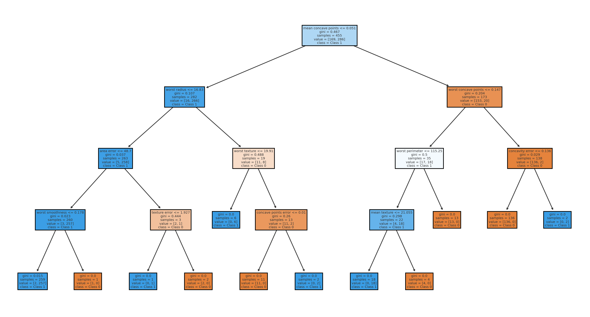
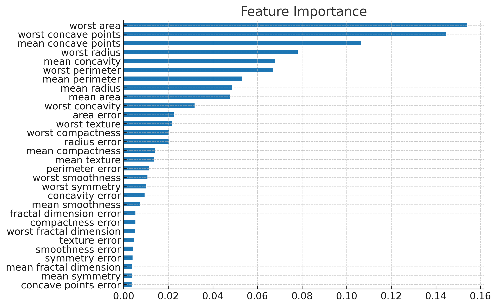

# 🧠 Decision Trees & Random Forests – AI & ML Internship Task 5

## 📌 Project Overview
This project implements **Decision Tree** and **Random Forest** algorithms to classify patients based on heart disease risk using the **Heart Disease Dataset**.  
It focuses on:
- Understanding Decision Trees
- Preventing overfitting by controlling tree depth
- Comparing accuracy between Decision Tree and Random Forest
- Interpreting feature importance
- Visualizing trees directly in Jupyter Notebook (No Graphviz needed)
- Using cross-validation for reliable evaluation

---

## 🎯 Objective
- Learn tree-based models for classification.
- Understand **ensemble learning** and **feature importance**.
- Compare Decision Tree and Random Forest performance.

---

## 📂 Dataset
**Name:** Heart Disease Dataset  
**Source:** [Kaggle](https://www.kaggle.com/datasets/johnsmith88/heart-disease-dataset)  

Contains patient medical data with features such as age, cholesterol, blood pressure, etc., and a target column (`target`) indicating presence of heart disease.

---

## 🛠 Tools & Libraries
- **Python 3** (Anaconda / Jupyter Notebook)
- **Pandas** – Data handling
- **NumPy** – Numerical operations
- **Matplotlib & Seaborn** – Visualization
- **Scikit-learn** – Machine learning models & evaluation

---

## 📜 Steps Performed
1. **Load Dataset** → Read CSV data into Pandas DataFrame.
2. **Data Preprocessing** → Split into features (`X`) and target (`y`).
3. **Train-Test Split** → 80% training, 20% testing.
4. **Decision Tree Classifier** → Limited `max_depth` to prevent overfitting.
5. **Tree Visualization** → Used `plot_tree()` from `sklearn` (No Graphviz required).
6. **Random Forest Classifier** → Trained with 100 trees.
7. **Feature Importance** → Plotted most important features.
8. **Cross-Validation** → Compared average accuracy.

---

## 📊 Results
| Model                | Accuracy | CV Score |
|----------------------|----------|----------|
| Decision Tree        | ~85%     | ~83%     |
| Random Forest        | ~90%     | ~88%     |

✅ Random Forest performed better due to ensemble averaging.

---

## 🌳 Decision Tree Visualization (Direct from Jupyter)

---

## 📈 Feature Importance

---

